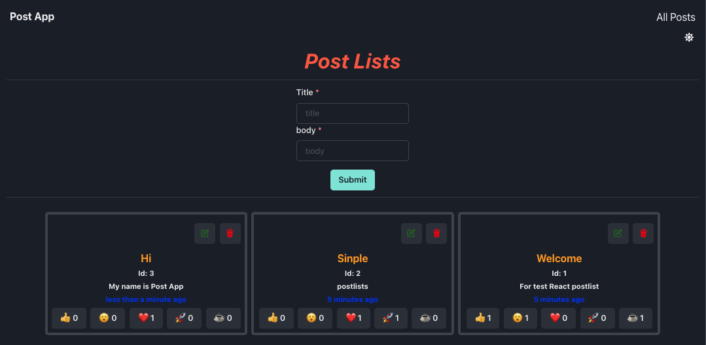

# Posts React RTK Advanced

CRUD with Redux RTK Query Advanced with createEntityAdapter and InjectEndpoints
# Table of contents

- [Posts React RTK Advanced](#posts-react-rtk-advanced)
- [Table of contents](#table-of-contents)
- [How to start](#how-to-start)
- [Tech stack and Features](#tech-stack-and-features)
- [Example](#example)
- [Tacticals](#tacticals)
  - [Advanced RTK createEntityAdapter](#advanced-rtk-createentityadapter)

# How to start
```bash
json-server data/db.json -p 3500 && yarn start
```

# Tech stack and Features

- Front end: [React](https://reactjs.org/)
- Css: [Chakra-ui](https://chakra-ui.com/)
- Api: [Json-server](https://github.com/typicode/json-server)
- State management & api Cache: [Redux toolkit RTK](https://redux-toolkit.js.org/)
- crud post
- store data to json
- emoji state by post

# Example

# Tacticals

## Advanced RTK createEntityAdapter

we add selectId and sortComparer for query

```typescript
// postSlice.ts
const postAdapter = createEntityAdapter<Post>({
  selectId: (post) => post.id,
  sortComparer: (a, b) => b.date.localeCompare(a.date),
});
```